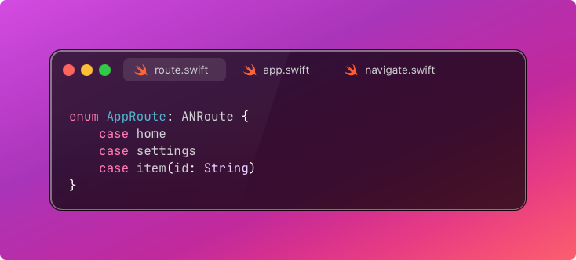
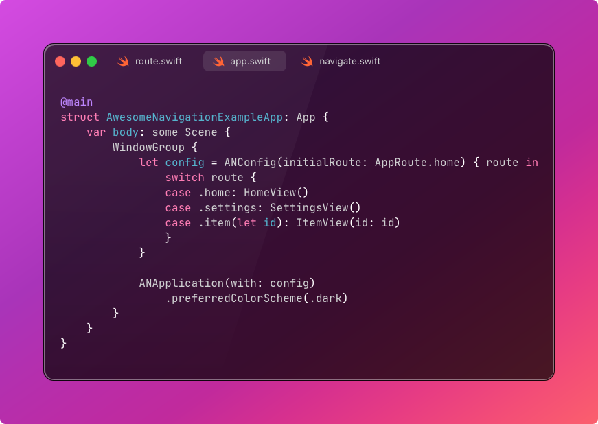
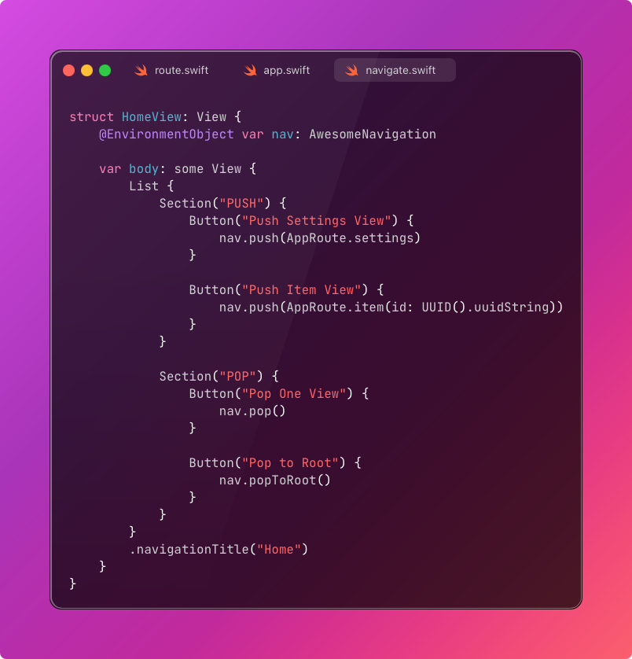

[](https://swiftpackageindex.com/k-arindam/AwesomeNavigation) [](https://swiftpackageindex.com/k-arindam/AwesomeNavigation)


# 🚀 AwesomeNavigation

**AwesomeNavigation** is a lightweight and elegant SwiftUI navigation library designed to make routing in iOS/macOS apps simple, declarative, and centralized — all while retaining native SwiftUI performance and flexibility.

---

## ✨ Features

* 🚦 **Centralized Navigation Management** using a shared singleton or injectable instance.
* 🛝 **Type-safe Route Definition** using the `ANRoute` protocol.
* ↺ **Push**, **Pop**, **PushReplacement**, **PopToRoot** — all made easy.
* 🔧 **Configurable Root and Transitions** via `ANConfig`.
* 💡 **Declarative API** that fits naturally into SwiftUI’s ecosystem.
* ⚡ **Swift Package** ready for seamless integration.

---

## 🎞 Installation

Use **Swift Package Manager**:

### In Xcode:

1. Open your project.
2. Go to **File > Add Packages…**
3. Enter the repository URL:

   ```
   https://github.com/k-arindam/AwesomeNavigation.git
   ```
4. Add the package and import it where needed:

   ```swift
   import AwesomeNavigation
   ```

---

## 🚀 Getting Started

### Step 1: Define your routes



---

### Step 2: Initialize the app with a config



---

## 🛍 Navigating Between Views

You can use the provided navigation methods from any view using `@EnvironmentObject`.

### Example: HomeView



---

## 📌 Core Components

### `AwesomeNavigation`

A shared or injectable navigation controller that holds and manipulates the `NavigationPath`.

### `ANRoute`

Protocol to define your route types. Conforming types must be `Hashable`, `Codable`, and `Sendable`.

### `ANConfig`

Configuration for your application including:

* Initial route
* Animation style
* Route-to-View builder closure

### `ANApplication`

Entry-point `View` that wraps `NavigationStack` and injects navigation environment.

---

## 📈 Future Scope

Here are a few exciting features planned for upcoming releases:

* [ ] 🥪 Unit-testable navigation by allowing injection of `AwesomeNavigation` (non-singleton mode)
* [ ] 🔍 Deep linking support via pre-filled `NavigationPath`
* [ ] 🧱 Scoped navigation contexts (multiple stacks in one app)
* [ ] 🛡️ Interception hooks (e.g., `onRouteWillPush`, auth guards, analytics)
* [ ] 🧑‍💻 DevTools-style route inspector/debug overlay
* [ ] 📱 iPad/macOS optimized UI state sync (split views, multiple windows)

---

## 🛠 Contributing

Pull requests are welcome! Feel free to open issues for bug reports or feature suggestions.

---

## 📄 Legal

- [**MIT License**](LICENSE)
- [**Code of Conduct**](CODE_OF_CONDUCT.md)

---

## 🙌 Acknowledgements

Inspired by:

* SwiftUI's native navigation stack
* Navigator paradigms from Flutter and React Router

---

## ❤️ Example App

A demo implementation is included in the `Example/` folder.

```swift
@main
struct AwesomeNavigationExampleApp: App {
    ...
}
```

---

Banner image created by [Canva AI](https://www.canva.com/ai)
